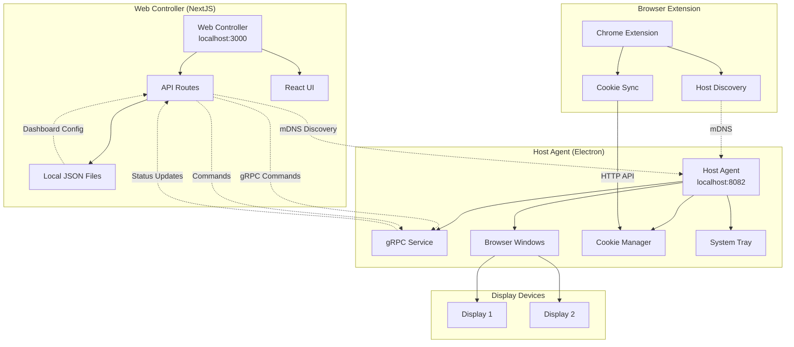
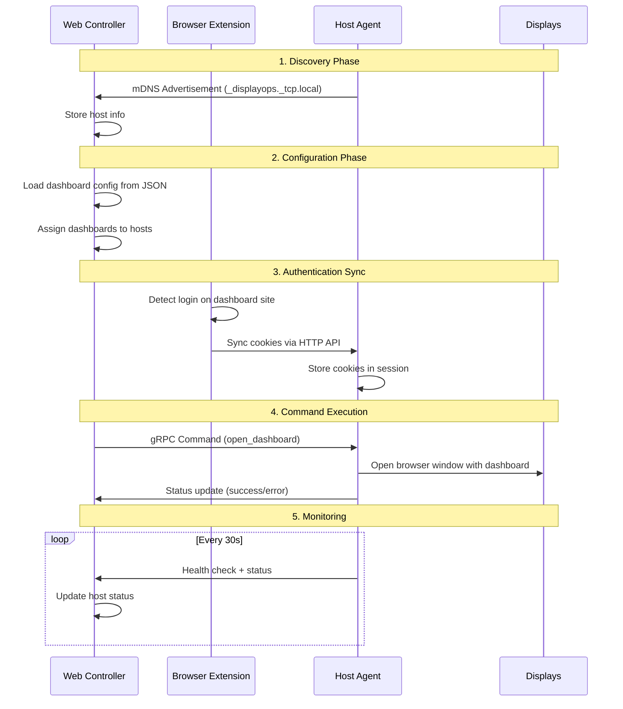

# DisplayOps Management System - Architecture

## Overview
A distributed system to manage multiple displays in an office environment, handling dashboard display, authentication, and monitoring across multiple mini PCs.

## System Components

### 1. Web Controller (NextJS)
- **Purpose**: Central control interface for managing all displays
- **Technology**: NextJS with TypeScript
- **Responsibilities**:
  - Provide web interface for display configuration
  - Manage dashboard assignments per display
  - Handle cookie synchronization
  - Monitor host agent status
  - Store configuration in local JSON files

### 2. Host Agent (Electron)
- **Purpose**: Desktop application running on each mini PC controlling 2 displays
- **Technology**: Electron with TypeScript
- **Architecture**: Main process + Renderer processes for each display
- **Responsibilities**:
  - Receive commands from web controller via REST API
  - Manage dual-display windows with native Electron APIs
  - Handle cookie synchronization using Electron session API
  - Monitor dashboard health via IPC communication
  - Auto-update using Electron's autoUpdater module
  - Report status back to controller

### 3. Communication Layer
- **Discovery**: mDNS/Bonjour for automatic service discovery
- **Protocol**: REST API with JSON payloads  
- **Authentication**: Simple token-based auth
- **Service Name**: `_displayops._tcp.local`
- **Commands**:
  - `open_dashboard` - Navigate to specific dashboard
  - `sync_cookies` - Copy authentication cookies
  - `health_check` - Report system status
  - `update_agent` - Download and install updates

## Data Flow

1. **Discovery**: Host agents advertise `_displayops._tcp.local` service on startup
2. **Registration**: Web controller discovers agents automatically via mDNS
3. **Configuration**: User configures dashboards via web interface
4. **Command**: Web controller sends commands to discovered host agents
5. **Execution**: Host agents execute commands using Electron windows
6. **Monitoring**: Continuous health checks and status reporting
7. **Updates**: Automatic agent updates when new versions available

## Network Architecture

### Diagrama de Arquitetura Atual

### Fluxo de Dados Detalhado

### Componentes e Responsabilidades

| Componente | Tecnologia | Porta | Responsabilidade |
|------------|------------|-------|------------------|
| Web Controller | NextJS | 3000 | Interface web, gestão de dashboards |
| Host Agent | Electron | 8082 | Controle de displays, execução de comandos |
| Browser Extension | Chrome Ext | - | Sincronização de cookies |
| mDNS Service | Bonjour | 5353 | Descoberta automática de hosts |
| gRPC Service | gRPC | 8082 | Comunicação controller ↔ host |
| HTTP API | Express | 8080 | API para extensão do navegador |

## Security Considerations

- Host agents only accept commands from configured controller IP
- Cookie data encrypted during transfer
- No persistent storage of sensitive authentication data on hosts
- Auto-update mechanism with signature verification

## Future Enhancements

- AWS integration for cloud-based configuration
- Advanced scheduling and rotation features
- Mobile app for quick TV control
- Integration with office automation systems
