# Fluxos de Dados Críticos - Sistema Atual

## Visão Geral
Este documento descreve os fluxos de dados críticos do sistema, incluindo descoberta de hosts, sincronização de cookies, execução de comandos e monitoramento.

## 1. Fluxo de Descoberta de Hosts (mDNS)

### 1.1 Anúncio do Host Agent
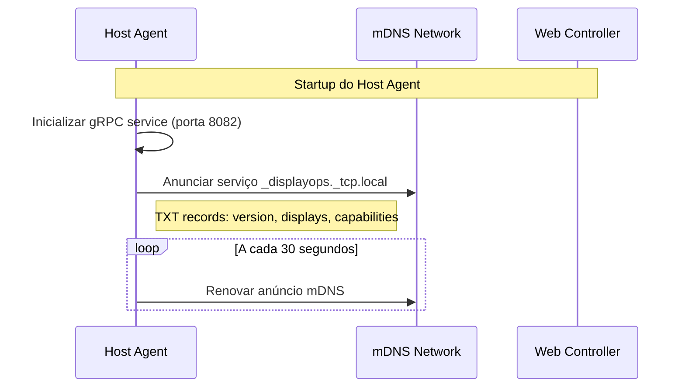

### 1.2 Descoberta pelo Web Controller
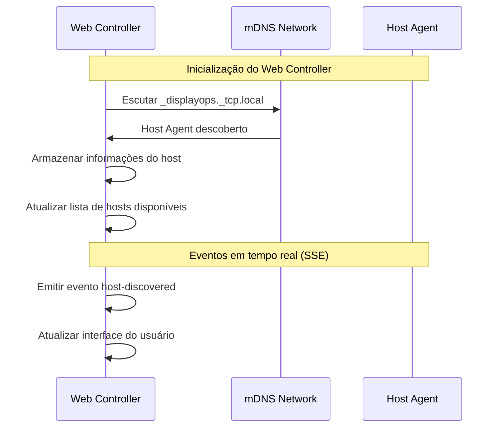

### 1.3 Dados Transmitidos
```json
{
  "hostId": "host-001",
  "name": "Display-001",
  "address": "192.168.1.100",
  "port": 8082,
  "capabilities": ["display", "browser", "cookies"],
  "metadata": {
    "version": "1.0.0",
    "displays": 2,
    "location": "1º Andar",
    "department": "Marketing"
  }
}
```

## 2. Fluxo de Sincronização de Cookies

### 2.1 Detecção de Login pela Extensão
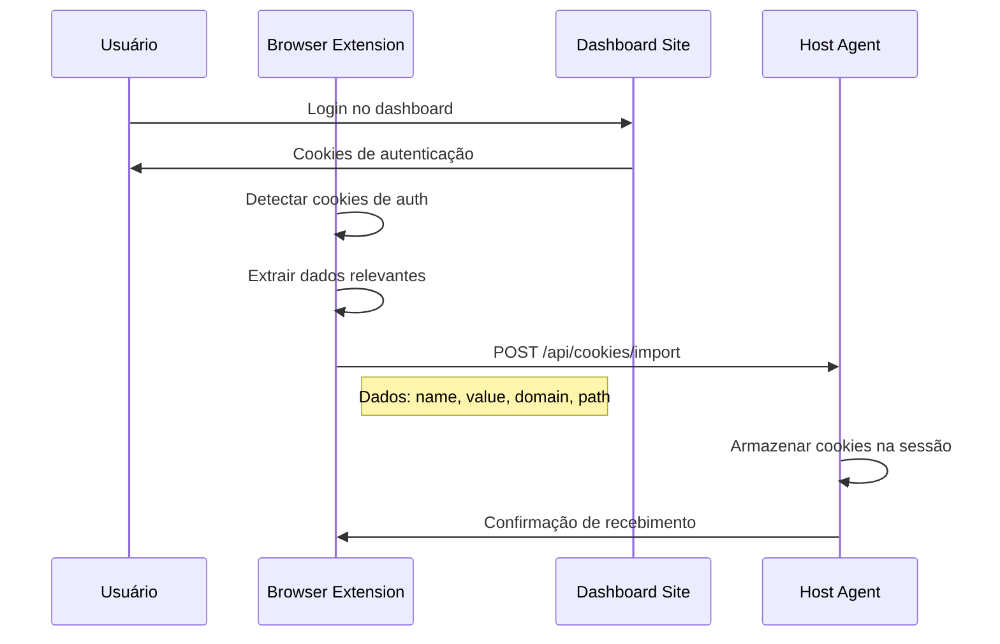

### 2.2 Estrutura dos Cookies
```json
{
  "cookies": [
    {
      "name": "session",
      "value": "abc123def456",
      "domain": ".example.com",
      "path": "/",
      "secure": true,
      "httpOnly": true,
      "expires": 1735689600
    }
  ],
  "assignedHosts": ["host-001", "host-002"]
}
```

### 2.3 Aplicação nos Displays
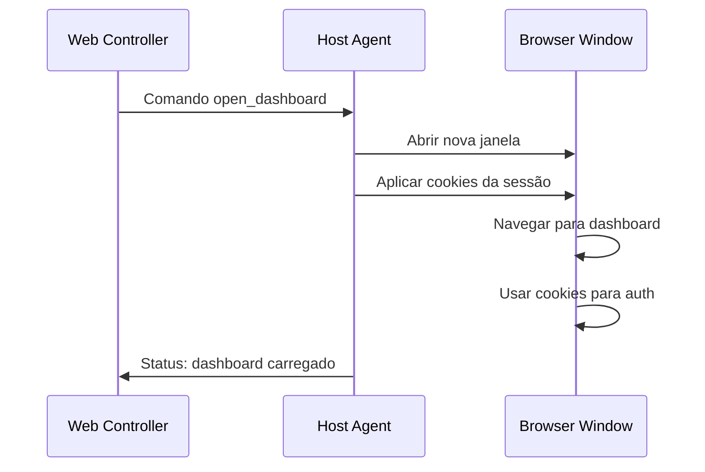

## 3. Fluxo de Execução de Comandos

### 3.1 Comando de Navegação
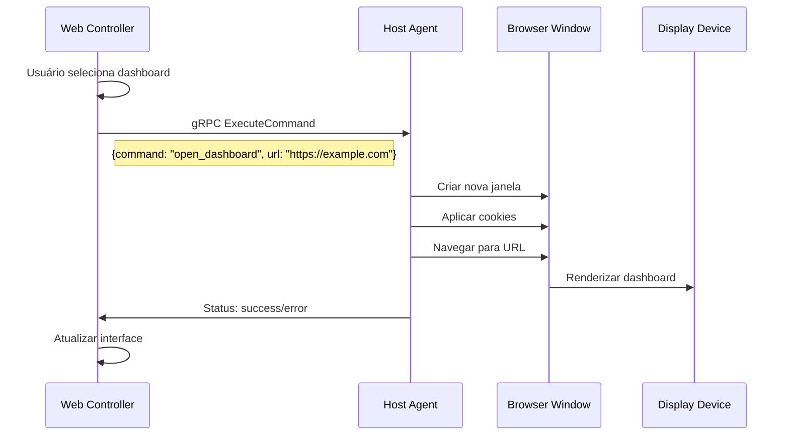

### 3.2 Comando de Refresh
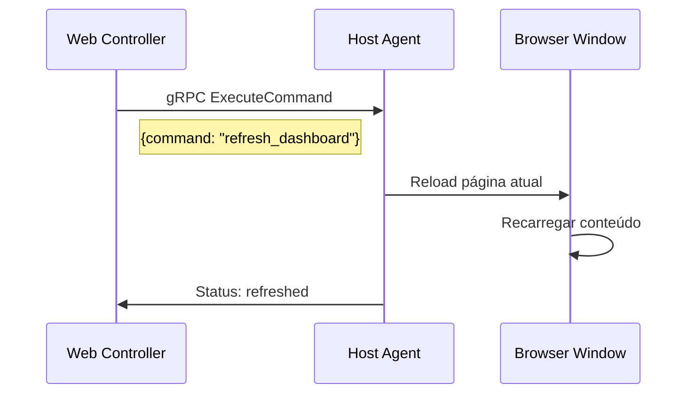

### 3.3 Estrutura dos Comandos gRPC
```protobuf
message Command {
  string command = 1;
  string display_id = 2;
  string dashboard_id = 3;
  string url = 4;
  bool fullscreen = 5;
  map<string, string> params = 6;
}

message CommandResponse {
  bool success = 1;
  string message = 2;
  string error = 3;
  int64 timestamp = 4;
}
```

## 4. Fluxo de Monitoramento e Health Check

### 4.1 Health Check Automático
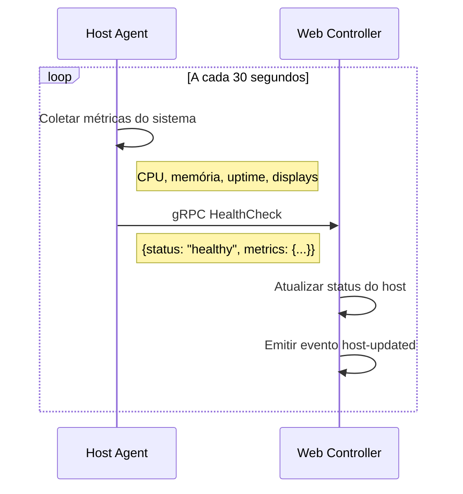

### 4.2 Métricas Coletadas
```json
{
  "hostId": "host-001",
  "status": "healthy",
  "uptime": 3600,
  "system": {
    "cpu": {
      "usage": 25.5,
      "cores": 4
    },
    "memory": {
      "used": 2048,
      "total": 8192,
      "percentage": 25.0
    },
    "disk": {
      "used": 50000,
      "total": 250000,
      "percentage": 20.0
    }
  },
  "displays": [
    {
      "id": "display-1",
      "status": "active",
      "currentUrl": "https://example.com",
      "lastUpdate": "2024-01-01T10:00:00Z"
    }
  ],
  "timestamp": "2024-01-01T10:00:00Z"
}
```

## 5. Fluxo de Configuração de Dashboards

### 5.1 Criação de Dashboard
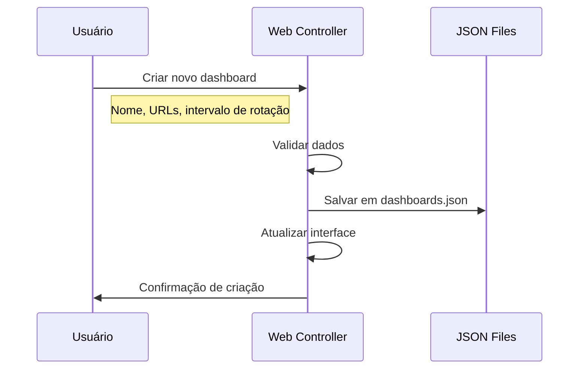

### 5.2 Atribuição de Hosts
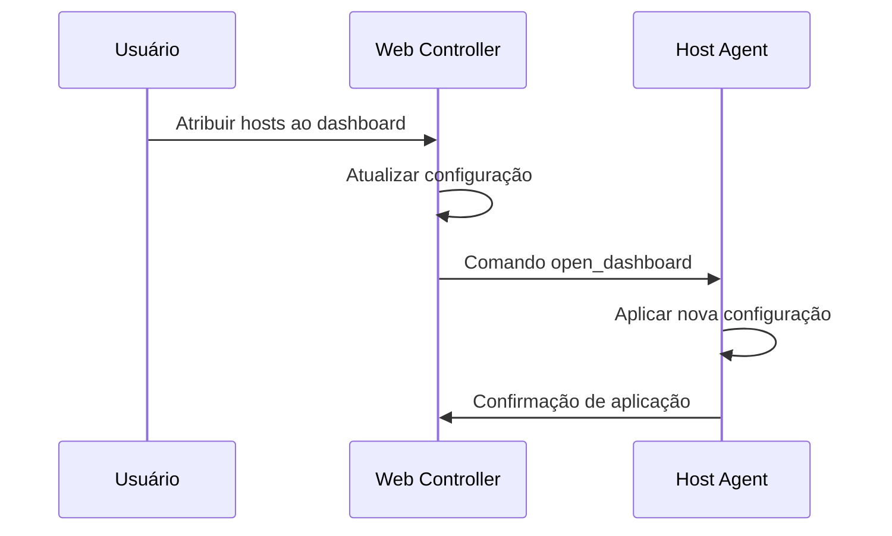

### 5.3 Estrutura de Configuração
```json
{
  "dashboards": [
    {
      "id": "dashboard-001",
      "name": "Marketing Dashboard",
      "description": "Dashboard para equipe de marketing",
      "urls": [
        "https://analytics.google.com",
        "https://facebook.com/insights"
      ],
      "rotationInterval": 30000,
      "assignedHosts": ["host-001", "host-002"],
      "createdAt": "2024-01-01T00:00:00Z",
      "updatedAt": "2024-01-01T00:00:00Z"
    }
  ]
}
```

## 6. Fluxo de Tratamento de Erros

### 6.1 Erro de Conexão
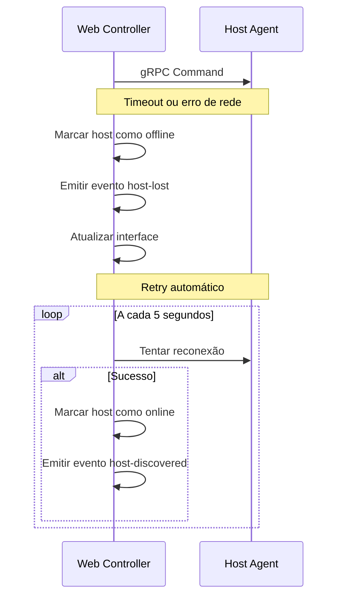

### 6.2 Erro de Comando
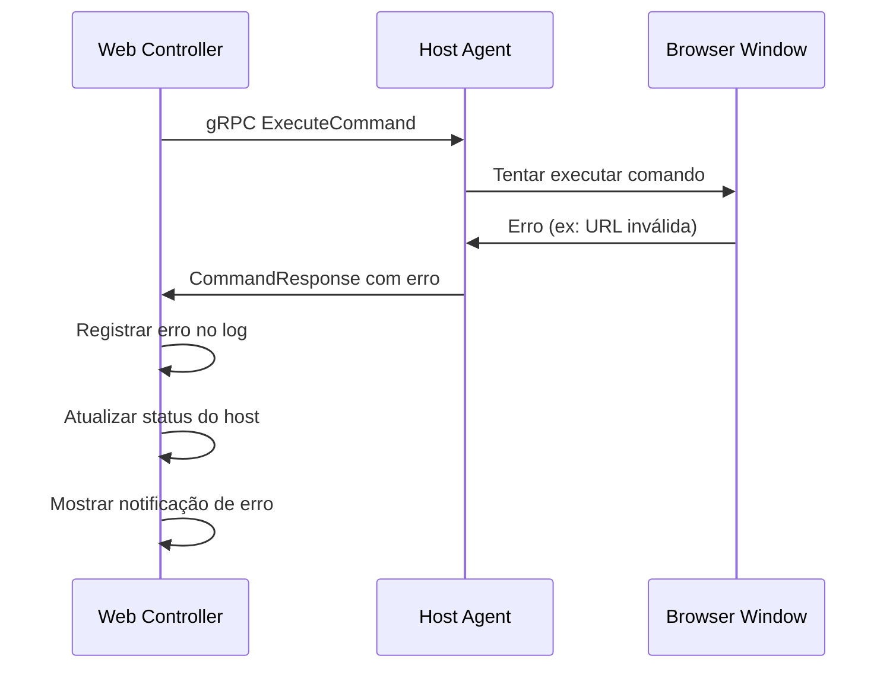

## 7. Fluxo de Dados Persistentes

### 7.1 Armazenamento Local
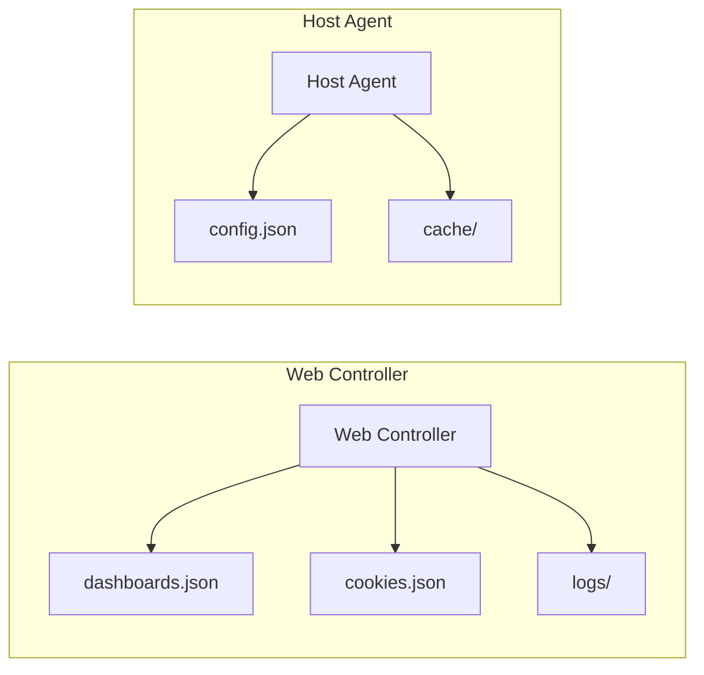

### 7.2 Estrutura dos Arquivos
```json
// dashboards.json
{
  "dashboards": [...],
  "lastUpdated": "2024-01-01T10:00:00Z",
  "version": "1.0.0"
}

// cookies.json
{
  "cookies": [...],
  "lastSync": "2024-01-01T10:00:00Z"
}

// config.json (Host Agent)
{
  "hostId": "host-001",
  "name": "Display-001",
  "displays": 2,
  "autoStart": true,
  "logLevel": "info"
}
```

## 8. Considerações de Performance

### 8.1 Latência Típica
- **mDNS Discovery**: 1-3 segundos
- **gRPC Command**: 50-200ms
- **Cookie Sync**: 100-500ms
- **Health Check**: 100-300ms

### 8.2 Throughput
- **Comandos simultâneos**: 10-50 por segundo
- **Hosts suportados**: 100+ por controller
- **Cookies por host**: 1000+ cookies
- **Dashboards**: 100+ por controller

### 8.3 Otimizações
- **Caching**: Dados de hosts em memória
- **Compression**: gRPC com gzip
- **Batching**: Múltiplos comandos em uma requisição
- **Connection Pooling**: Reutilização de conexões gRPC
